[尚硅谷24python——b站传送门](https://www.bilibili.com/video/BV1eZ421b7ag?p=1&vd_source=796ed40051b301bfa3a84ba357f4828c)

## 1. 初识 python



### 1-1 第一个程序

```python
# 打印数字(块注释)
print(11)  # 行内注释 与代码同行，#前面至少有两个空格

# 打印字符 不区分单双引号
print("hello world")
print('hello world')
```

### 1-2 注释

- 作用：方便阅读代码时，能够快速的了解代码的功能，不会被执行。
- 分类：
  - 块注释
  - 行内注释
  - 多行注释
- 使用规范：
  1. 注释不是越多越好，对于一目了然的代码，不需要添加注释
  2. 对于复杂的操作，应该在操作开始前写上若干行注释
  3. 对于不是一目了然的代码，应在其行尾添加注释
  4. 绝不要描述代码，假设阅读代码的人比你更懂Python，他只是不知道你的代码要做什么

```python
# 块注释
# 我是一行注释
print(111)

# 行内注释
print(111)  # 我是行内注释  与代码同行，建议前面至少有两个空格

# 多行注释 不区分单双引号
"""
我是多行注释
我是多行注释
"""

'''
我也是多行注释
我也是多行注释
'''
```

**块注释：**

- 以`#`开始，一直到本行结束都是注释
- 为了保证代码的可读性，**`#`后面建议先添加一个空格**，然后再编写相应的说明文字(PEP8)
- 注释不会运行
- 代码是给机器执行用的，注释是给人看的，方便阅读代码时，能够快速的了解代码的功能

**行内注释：**

- 以#开始，一直到本行结束都是注释
- **与代码写在同一行**
- **`#`前面至少有两个空格**

**多行注释：**

- 如果希望编写的注释信息很多，一行无法显示，就可以使用多行注释
- 要在python程序中使用多行注释，可以用**一对连续的三个引号**（单引号和双引号都可以)

### 1-3 print()

`print()`函数：`print(*objects, sep=' ', end='\n', file=none, flush=False)`

- `*objects`:表示可以接受多个字符串，用逗号隔开，也可以接受一个字符串列表
- `sep`:表示多个字符串之间的分隔符，默认为一个空格
- `end`:表示结尾的字符，默认为一个换行符
- `file`:表示输出位置，默认为标准输出，即屏幕
- `flush`:表示是否立即把内容输出到file中，默认为False

#### 简单的打印

```python
# 任务一：打印字符串 我是nya~
# print(我是shio~)  # 报错，因为字符串需要用引号括起来
print("我是shio~")

# 任务二：打印数字2024
print(2024)

# 任务三：打印变量 创建一个变量year，值为2024，打印这个变量的值
year = 2024
print(year)  # 打印变量的值2024
```

#### 多个内容的打印

```python
# 任务四：一行中打印多个内容
'''
想要在一行中打印多个内容，可以在print()函数中使用逗号隔开多个内容
变量、数字、字符串都可以
注意使用英文的逗号
'''
print("今年是", year, "年，我要减肥")  # 打印多个内容，默认用空格隔开

# 任务五：打印多个内容，指定分隔符和结尾字符
print("hello", "world", sep=" ", end="!")
print("今年是", year, "年，我要减肥", sep="", end="\n\n")  # 打印多个内容，参数间用逗号隔开 指定分隔符为无
print("今年是", year, "年，我要读100本书", sep="", end="\n\n")
print("今年是", year, "年，我要去10个城市旅游", sep="", end="\n\n")
```

#### 格式化输出打印

> 1. `%`格式化操作符方式格式化打印
> 2. `format()`指定格式输出打印

```python
# 任务六：格式化输出
year = 2024
month = 2
day = 20
week = '一'
weather = '晴'
temp = 19.5
# 使用%格式化输出
print("今天是%d年%2d月%d日，星期%s，天气%s，温度%.1f℃。" % (year, month, day, week, weather, temp))
print("今天是%d年%02d月%d日，星期%s，天气%s，温度%.1f℃。" % (year, month, day, week, weather, temp))
# 使用format()函数格式化输出
print("今天是{}年{}月{}日，星期{}，天气{}，温度{}℃。".format(year, month, day, week, weather, temp))
# format指定格式输出  # {0}表示第一个参数，{1:02d}表示第二个参数，保留两位数，不足两位前面补0，..., {5:.1f}表示第六个参数，保留一位小数
print("今天是{0}年{1:02d}月{2}日，星期{3}，天气{4}，温度{5:.1f}℃。"
      .format(year, month, day, week, weather, temp))
```

控制台:

```shell
今天是2024年 2月20日，星期一，天气晴，温度19.5℃。
今天是2024年02月20日，星期一，天气晴，温度19.5℃。
今天是2024年2月20日，星期一，天气晴，温度19.5℃。
今天是2024年02月20日，星期一，天气晴，温度19.5℃。
```

**`%`格式化操作符方式格式化打印：**

`print("格式化字符串" % (变量1， 变量2...))`

- 如果希望输出文字信息的同时，一起输出数据，就需要使用到格式化操作符
- `%`被称为格式化操作符，专门用于处理字符串中的格式
  - 包含`%`的字符串，被称为格式化字符串
  - `%`和不同的`字符`连用，不同类型的数据需要使用不同的格式化字符

| 格式化字符 | 含义                                                         |
| ---------- | ------------------------------------------------------------ |
| `%s`       | 字符串                                                       |
| `%d`       | 有符号十进制整数，`%06d`表示输出整数显示的位数`6`，不足的地方使用`0`补全 |
| `%f`       | 浮点数，`%2f` 表示小数点后只显示两位                         |
| `%%`       | 输出`%                                                       |

**`format()`指定格式输出打印：**

`format()`指定格式输出，使用{}进行占位，也可以进行格式限制

- 如：`{1:02d}`表示第二个参数保留两位数，不足两位前面补0

### 1-4 input()

input函数

- `input()`函数用于接收用户输入，**返回值为字符串类型**
- 语法：`input([提示信息])`
- `提示信息`可选，如果不提供，则默认提示用户输入
- input函数会将用户输入的内容作为字符串返回s

```python
import datetime
# 任务1：创建变量name,保存用户输入的名字;打印变量name
name = input("请输入您的名字：")  # input函数会将用户输入的内容作为字符串返回
type(name)  # <class 'str'> input()返回值为字符串类型
print("您的名字是：", name)

# 任务2：
# 创建变量age,保存用户输入的年龄；打印用户的出生年份
age = int(input("请输入您的年龄："))
type(age)  # <class 'int'> input()返回值为字符串类型，需要使用int()函数将字符串转换为整数
birth_year = datetime.datetime.now().year - age
print("您的出生年份是：", birth_year)
```

### 1-5 案例：个人名片

```python
# 在控制台依次提示用户输入：姓名、公司、职位、电话、邮箱
name = input("请输入姓名：")
company = input("请输入公司：")
job = input("请输入职位：")
phone = input("请输入电话：")
email = input("请输入邮箱：")
# 打印分隔线
print("------------------------------------------------")
# 打印个人名片
print("姓名：", name)
print("公司：%s" % company)
print("职位：", job)
print("电话：", phone)
print("邮箱：", email)
# 打印分隔线
print("------------------------------------------------")
```

## 2. 变量与简单数据类型



### 2.1 变量

**代码**：处理数据用的
**变量**：存储数据的

#### 2.1.1 变量的定义

**创建变量**(变量的赋值、变量的定义)：`变量名=变量值`

>变量定义之后，后续就可以直接使用了
>变量必须先定义后使用
>$=$两边要留一个空格

**多个变量的赋值**：

```python
# 多个变量的值相同
num1 = num2 = num3 = 10

# 多个变量的值不同，元组赋值
a, b = 10, 20
```

**案例**：买苹果：

```python
# 任务：买苹果
price = 10.5
weight = 7.5
money = price * weight
print("需要支付 %.2f 元" % money)
```

#### 2.1.2 修改变量

**修改变量**：创建变量后，可以在代码中重新赋值。

```python
year = 2023
print(year)  # 打印2023
year = 2024
print(year)  # 打印2024
```

**不同类型的变量也可以进行修改**、重新赋值，与类型无关。

```python
money = '十元'
money = 10
print(money)  # 打印10
```

#### 2.1.3 常量

程序在运行的过程中，值永远不会发生改变的量称之为常量。
python没有专门的常量类型，一般**约定俗成使用大写表示常量**。

```python
# 圆周率
PI = 3.1415926
# 我的生日
MY_BIRTHDAY = '2024-01-19'
```

#### 2.1.4 变量的命名

**标示符**：标示符就是程序员定义的**变量名**
**函数名**：名字需要有**见名知义**的效果

**标示符的命名：**

- 可以由字母、下划线 和数字组成
- 不能以数字开头
- 不能与关键字重名

**关键字：**

- 关键字就是在Python内部已经使用的标识符
- 关键字具有特殊的功能和含义
- 开发者不允许定义和关键字相同的名字的标示符

**变量的命名规则：**

- 命名规则可以被视为一种惯例，并无绝对与强制

- 目的是为了增加代码的识别和可读性

- 在Python中，如果**变量名**需要由**二个或多个单词组成时**，可以按照以
  下方式命名

  - 每个单词都使用**小写字母**
  - 单词与单词之间使用**下划线**连接

  > 例如：first_name、last_name、qq_number、qq_password

- **驼峰命名法**
  当**变量名**是由**2个或多个单词**组成时，**还可以利用驼峰命名法**来命名。

  - ***小驼峰式命名法***
    第一单词以小写字母开始，后续单词的首字母大写

    > 例如：firstName、lastName

  - **大驼峰式命名法**
    每一个单词的首字母都采用大写字母

    > 例如：FirstName、LastName、CamelCase

#### 2.1.5 变量的数据类型

在Python中定义变量是不需要指定类型（在其他良多高级语言中都需要)

我们可以使用`type`和`isinstance`来**测试和判断数据类型**

```python
a = '123455asd'
print(type(a))  # <class 'str'>
print(isinstance(a, str))  # True
print(isinstance(a, int))  # False
```

**Python中的数据类型：**

- 整型(Integers)
  表示整数，不带小数点。
  例如：`100`。
- 浮点型(Floating point numbers)
  表示带有小数点的数字。
  例如：`15.20`。
- 复数(Complex Numbers)
  表示带有实部和虚部的数字。
  例如：`3.14`。
- 布尔型(Boolean)
  表示真假。
  有两个值，`True`或`False`。
- 字符串（String)
  一串字符
  例如：`"Hello,World"`。
- 列表(List)
  有序的集合，可以包含任何数据类型
  例如：`[1，'a',2.3]`。
- 元组(Tuple)
  类似于列表，但不可变
  例如：`(1，'a',2.3)`
- 集合(Set)
  无序且不重复的元素集合
  例如：`{1,2,3}`。
- 字典(Dictionary)
  键值对的集合。
  例如：`{name: 'John', age: 30}`

### 2.2 简单数据类型

整型、浮点型、布尔型、字符串、

#### 2.2.1 整形(Integers)

Python可以处理任意大小的整数，当然包括负整数，在程序中的表示方法和数学上的写法一模一样。

```python
# 整数变量的定义
num = 10
print(num)

# 负数
num2 = -10
print(num2)

# 查看变量的数据类型
print(type(num2))  # <class 'int'>
```

#### 2.2.2 浮点型(Floating point numbers)

由整数部分和小数部分组成。

**注意**：运算可能有四舍五入的**误差**。

```python
# 浮点数的计算
n1 = 1.1
n2 = 2.2
print(n1 + n2)  # 3.30000000000000004

# 四舍五入方式进行保留精度
n3 = round(n1 + n2, 1)  # 保留一位小数
print(n3)  # 3.3

import math
print(math.floor(n3))  # 向下取整  3
print(math.ceil(n3))  # 向上取整  4
```

#### 2.2.3 布尔型(Boolean)

- 布尔类型的变量只有`True`、`False`两种值。
- 作用：作为**真假的判断**。
- 在python中，能够解释为假的值有：
  `None`、`0`、`0.0`、`False`、所有的空容器（空列表、空元组、空字典、空集合、空字符串)

#### 2.2.4 字符串(String)

字符串就是**一串字符**，是编程语言中表示文本的数据类型。

- 在Python中可以使用**一对双引号"**或者**一对单引号'**定义一个字符串
- 字符串是以单引号或者双引号括起来的任意文本，**也可以是以三对单引号'''或者双引号"""**引起来的任意文本

```python
# 创建字符串
s1 = 'hello'
print(s1)
s2 = "world"
print(s2)
s3 = '''hello
world'''
print(s3)  # hello
           # world
s4 = "It's a hat"
print(s4)  # It's a hat

s5 = '1234\'\"666'  # 在字符串中使用\转义字符
print(s5)  # 1234'"666
```

**运算：**

- 字符串加法(字符串拼接)
- 字符串乘法(字符串重复)

```py
# 字符串拼接
print(s1 + s2)  # helloworld
# 字符串与数字不能相加
# print(s1 + 1)  # TypeError: can only concatenate str (not "int") to str

# 字符串与字符串相乘
print(s1 * 5)  # hellohellohellohellohello
```

**索引：**可以使用索引获取一个字符串中指定位置的字符，**索引计数从0开始**。

**获取指定索引处字符：**

```python
s = "hello world"
print(s[0])  # h
print(s[4])  # o
print(s[-1])  # d
```

**字符串切片，包头不包尾：**`变量名[起始索引:结束索引(:步长)]`

```python
s = "hello world"
# 字符串切片 包头不包尾
print('字符串切片')
print(s[0:4])  # hell 从索引0开始，到索引4结束，不包括索引4
print(s[1:4])  # ello 从索引1开始，到索引4结束，不包括索引4
print(s[:4])  # hell 从索引0开始，到索引4结束，不包括索引4
print(s[6:])  # world 从索引6开始，到字符串结束
print(s[:])  # hello world 从索引0开始，到字符串结束
```

**字符串步长(不写默认为1)：**

```python
s = "hello world"
print(s[0:11])  # hello world 默认第三个值为1  从索引0开始，到索引10结束，每隔1个取一个字符
print(s[0:-1:1])  # hello world 从索引0开始，到索引-1(最后)结束，每隔2个取一个字符
print(s[0:11:2])  # hlowrd 从索引0开始，到索引10结束，每隔2个取一个字符
print(s[::2])  # hlowrd 从索引0开始，每隔2个取一个字符 到字符串结束
```

**字符串反转：**

```python
# 字符串反转
s2 = '1234567'
print(s2[-1:-10:-1])  # 7654321
print(s2[::-1])  # 7654321
```

#### 2.2.5 数据类型转换

| 函数名          | 函数值                                                       |
| :-------------- | :----------------------------------------------------------- |
| `int(x,[基数])` | 将数字或字符串转换为整数(十进制)，如果x为浮点数，则自动截断小数部分 |
| `float(x)`      | 将x转换成浮点型                                              |
| `bool(x)`       | 转换成bool类型的True或False                                  |
| `str(x)`        | 将x转换成字符串，适合人阅读                                  |

**转换为整形int：**

```py
# 字符串str-->整形int  纯数字的无小数字符串才可以转换
s = '2024'
print(type(int(s)))  # <class 'int'>
'''
s1 = 'aaa223'
print(type(int(s1)))  # ValueError: invalid literal for int() with base 10: 'aaa223'
s3 = '2.23'
print(type(int(s3)))  # ValueError: invalid literal for int() with base 10: '2.23'
'''

# 浮点数float-->整形int
f = 2.23
print(int(f))  # 2
print(type(int(f)))  # <class 'int'>

# 布尔值bool-->整形int
a, b = True, False
print(int(a), int(b))  # 1 0
print(type(int(a)))  # <class 'int'>
```

**转换为浮点数：**

```python
# 字符串str-->浮点数float
s = '2.23'
print(float(s))  # 2.23
print(type(float(s)))  # <class 'float'>
# 整形int-->浮点数float
i = 2
print(float(i))  # 2.0
print(type(float(i)))  # <class 'float'>
# 布尔值bool-->浮点数float
a, b = True, False
print(float(a), float(b))  # 1.0 0.0
print(type(float(a)))  # <class 'float'>
```

**转化为布尔值：**

```py
# 字符串str-->布尔值bool
s = '2.23'
print(bool(s))  # True
print(type(bool(s)))  # <class 'bool'>
# 整形int-->布尔值bool
i = 0
print(bool(i))  # False
print(type(bool(i)))  # <class 'bool'>
# 浮点数float-->布尔值bool
f = 0.0
print(bool(f))  # False
print(type(bool(f)))  # <class 'bool'>
# 空字符串
s = ''
print(bool(s))  # False
print(type(bool(s)))  # <class 'bool'>
# 空列表-->布尔值bool
l = []
print(bool(l))  # False
print(type(bool(l)))  # <class 'bool'>
# ...
```

**转化为字符串：**

```python
# 整形int-->字符串str
i = 2
print(str(i))  # 2
print(type(str(i)))  # <class 'str'>
# 浮点数float-->字符串str
f = 2.23
print(str(f))  # 2.23
print(type(str(f)))  # <class 'str'>
# 布尔值bool-->字符串str
a, b = True, False
print(str(a), str(b))  # True False
print(type(str(a)))  # <class 'str'>
# 空列表-->字符串str
l = []
print(str(l))  # []
# ...
```

**进制转换：**在Python中，`0b`、`0o`、`0x`前缀表示二进制、八进制、十六进制

```python
# 其他进制转为十进制
print(int('0x1a', 16))  # 26 十六进制转十进制
print(int('0b11010', 2))  # 26 二进制转十进制
print(int('0o32', 8))  # 26 八进制转十进制
# 十进制转为其他进制
print(oct(26))  # 0o32 十进制转八进制
print(bin(26))  # 0b11010 十进制转二进制
print(hex(26))  # 0x1a 十进制转十六进制
```

#### 2.2.6 小整数的地址问题

- Python中的小整数，通常指的是**-5至256之间的整数**
- 当你在Python中创建一个整数对象时，Python会根据该整数的值动态地为其分配内存空间。对于小整数Python会使用一种称为**“小整数缓存”的机制来优化内存使用**。**这个缓存池中的整数对象会被重复利用，而不是为每个新创建的小整数分配新的内存空间**。这样可以减少内存分配和释放的开销，提高程序的性能。
- 如果你需要跟踪Python对象的内存地址，可以使用Python提供的**内置函数`id()`来获取对象的唯一标识符**，这个标识符通常可以用来近似地表示对象的内存地址。**但是请注意**，这个标识符并不是真正的内存地址，而是由Pythont解释器生成的一个唯一标识符，用于区分不同的对象实例。

```python
>>> a = 3
>>> id(a)
140709743618552
>>> b = 3
>>> id(b)
140709743618552
>>> b = 4
>>> id(b)
140709743618584
>>> c = 300
>>> id(c)
2156628246032
>>> d = 300
>>> id(d)
2156628246256
```

